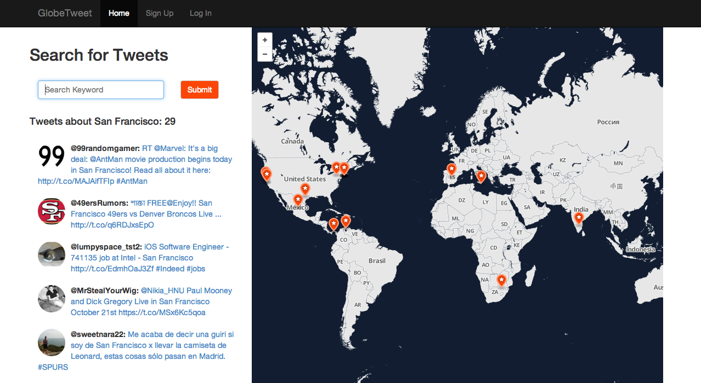

GlobeTweet
===========

Search any keyword to view a live stream of tweets along with location mapping.

##Overview

GlobeTweet allows users to search any keyword and view a live stream of related tweets. Tweet locations are pinned on the adjacent map in real-time.

##Motivation

The motivation for this project is to discover what people around the world are tweeting about a given topic at any moment. In addition, the location mapping feature provides insight into global Twitter Trends

##Built With:

* Node.js
* Express
* Socket.io
* Twitter API
* Mapbox
* PostgreSQL
* Sequelize

###Find it here: [http://globetweet.herokuapp.com/](http://globetweet.herokuapp.com/)

--------------------

